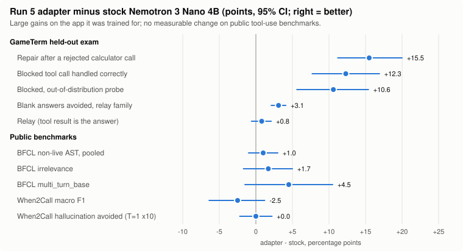

# One app, one inference stack, one GPU: RL for a small local model on its own app's tool turns

**Headline.** Nemotron 3 Nano 4B, trained with RLOO for 86 minutes on one RTX 5090, on the tool turns of the app it
runs in. After a rejected calculator call it now recovers **+15.5 points** more often [+11.2, +20.0]. Blank answers
after a tool result fall from 97 to 16 of 2,620. When the app refuses a file or terminal call, the model handles it
correctly **+12.3 points** more often [+7.7, +16.9]. On public tool-use benchmarks (BFCL, When2Call) there is **no
measurable change**: no regression, and no gain either. The adapter is a rank-32 LoRA of 1.0 million parameters on the
last MLP block.

This is a recipe, not a general tool-use model. The claim is narrow: if you ship an app with a small local model,
you can train that model on the app's own prompts, tools and rejections. It can take one GPU and an afternoon. Held-out
gates you declare in advance tell you whether it worked.

## Why the post-tool turn

In [GameTerm](https://gameterm.arkey.ai), the stock 4B could already call the calculator well enough to work with, and
tool selection had been handled by a separate adapter track. Relaying a result that answers the question also worked.
The weak spot was the turn after a result that does *not* settle the question: a miss, or a call the app rejected.
Thinking helps a lot there but does not close the gap, so that turn is what this RL trains. All numbers below are
for the stock model, with no adapter.

**Calling was workable (thinking on).** In GameTerm's full 35-tool request, one sample per task at temperature 1.0,
the stock model's first turn on 904 word problems was a `calculate` call 687 times. The calculator accepted 667 of
those calls and refused 20. On 205 more tasks it answered correctly without the tool, and only 4 went to another tool
(stock harvest for [run 4's tasks](../research/rloo-posttool-calculator-r4.md)). On GameTerm's frozen 132-item suite,
the first call picks the right tool on 15/16 selection items with thinking on and 11/16 with it off. That is a
modest gain, measured on only 16 items ([record](../research/countdown-thinking-e2e.md)).

**The weak spot is after the result.** The [post-result probe](../research/post-result-probe.md) fills in one
calculator call and its result, then samples only the next turn. It uses 16 held-out Countdown tasks x 4 seeds, 64
samples per cell and 4,096 tokens. The result is shown either as bare `expr = value` or in GameTerm's real JSON wire
envelope:

| Correct next turn, of 64 | Off, bare | Off, wire | On, bare | On, wire |
|---|---:|---:|---:|---:|
| hit: the result is the answer (relay) | 64 | 63 | 64 | 63 |
| miss: the result is not the target | 12 | **2** | 42 | **33** |
| rejected: GameTerm refused the call | 0 | 5 | 15 | 16 |

Relay works either way. After a miss or a rejection, thinking helps a lot, and the task-clustered CIs exclude 0 (bare format). It
still leaves 31 of 64 miss samples and 48 of 64 rejection samples wrong in the wire format. With thinking off, the
wire envelope makes the miss worse: 21 of 64 samples answered with the expression that had just missed.

On the word-problem training states, with thinking on
([stock headroom](../research/rloo-posttool-calculator.md)), held-out pass@1 is 0.99 for relay, against 0.83 for
repair, 0.58 for miss and 0.34 for the historical empty-answer states. On those last three, pass@8 is 17 to 41 points
above pass@1. The stock policy can already produce the right turn, but not reliably. The main failure is a turn that
reasons until the 4,096-token cap and gives no answer.

**Thinking on is the baseline, but its big win is reasoning, not calling.** End to end through GameTerm on the same
16 Countdown tasks, stock is right **46/64** with thinking on and **15/64** with it off (paired 95% CI of the gain
+35.9 to +60.9 points). Yet the episodes that called the calculator fell from 31 to 4. Thinking replaced tool use on
Countdown rather than improving it. Thinking on also kept every plain answer (40/40) on the retention suite
([record](../research/countdown-thinking-e2e.md)). Every run here uses thinking on.

**What that means for training.**

- Start each episode after the call: the model's own call (or a constructed one) and GameTerm's real reply, in the
  wire format, with thinking on.
- Reward only the final answer after the result. Tool calls are neither rewarded nor penalized. The earlier Countdown
  RLOO runs did the opposite: they trained the first turn, where a turn that called a tool scored 0. That trained
  against tool use, and neither run beat stock on the holdout (-2.7 and -0.7 points).
- Do not teach "call again after a miss" from solver-written traces. An SFT adapter trained that way called again on
  64/64 miss samples and answered none correctly ([probe](../research/post-result-probe.md)).

**How this relates to the tool-selection track.** The large first-call fix on record came from an adapter, not from
thinking. In a separate, earlier track with thinking **off**
([tool selection](../research/nemotron-tool-selection/RESULTS.md)), GameTerm's long 35-tool request cut stock selection
to 45.0% (144/320; calculate 22/40), against 82.2% with a short tool list. A rank-4 SFT adapter raised it to 94.7%
(303/320). Thinking-on selection on that 320-item suite was never measured. Even so, the calls the model made were well
formed: across both arms, all 904 proposed first calls passed their JSON schema, and all 136 `calculate` calls ran in
GameTerm's calculator and gave the right value. That adapter is not part of the post-tool work, which starts from the
stock model with thinking on.

So the precise claim is this: the post-tool track did not train tool calling, because calling was already workable
and selection had its own track. It trains the turn after a result that does not settle the question. The public
benchmarks below cannot isolate that turn. BFCL multi-turn failures mix call errors with result errors, and no
thinking-off benchmark arm was run.

## Setup

- **The app.** GameTerm, a terminal app with a built-in assistant served by llama.cpp's `llama-server`. The
  assistant has calculator, file and terminal tools, among others; this work concerns three situations *after* a tool call. **Repair**: the calculator
  rejected the call. **Relay**: the result is the answer and has to be mapped back to the question. **Blocked**: the
  app refused a file or terminal call by policy, and the model should say so rather than work around it or invent
  content.
- **The model.** [`nvidia/NVIDIA-Nemotron-3-Nano-4B-BF16`](https://huggingface.co/nvidia/NVIDIA-Nemotron-3-Nano-4B-BF16),
  thinking on, 4,096 tokens per turn, as the app runs it.
- **Exact match to the app.** Training states are the app's real request envelope: system prompt, every tool
  schema, the thinking flag and logit bias. Each state also holds the stock model's own first call and the app's
  real reply. Every rendered request matched what the app sends: 2,329/2,329 captured requests, and 65/65
  token-id checks against `llama-server`. Calculator replies come from the app's own calculator, and they matched
  2,251/2,251 captured results byte for byte ([runner](../tools/calculate-runner/)).
- **The hardware.** One 32 GB RTX 5090. Sampling and training both run in one
  [tinygrad](https://github.com/JulianAbeleda/tinygrad-arkey) process. There is no vLLM, no torch and no second GPU.

## Method

- **One-stack RLOO.** Each update samples 8 episodes for each of 4 states at temperature 1.0 and scores them with
  the task's verifier (graded reward: a right answer, a wrong answer, a blank, an abstention). The loss uses a
  leave-one-out baseline, a KL anchor to stock (beta 0.03), a small entropy term and a group length term, followed by
  one Adam step on the LoRA. An episode can call the calculator again, and the next request is rendered exactly as
  the app would send it (up to 8 turns).
- **Exact sampler/trainer parity.** The trainer recomputes the log-probability of every sampled token and compares
  it with the sampler's. A gap above 0.1 nats stops the run. In run 5 the maximum gap was 0. Before the long run,
  a one-update run is exported and reloaded in a fresh process, and the reload must match bit-exactly.
- **Predeclared gates.** The hypothesis, a numeric prediction for each gate, and the pass rules are committed before
  the first counted update. Gates are paired stock-vs-adapter bootstrap CIs, clustered by task, on held-out states
  (46 to 131 states x 20 samples). There are also blind audits for fabricated content, a retention check on
  unrelated items, and an out-of-distribution blocked probe (78 new states).
- **Stop triggers.** The loop checks KL, entropy, finished length, the capped-turn rate and reward drift over a rolling
  window. When one fires, it stops itself and keeps the adapter. A failed gate ends the experiment, with no rescue
  runs. Details: [RL run playbook](rl-run-playbook.md).

## Results

GameTerm held-out exam, run 5 against stock ([record](../research/rloo-posttool-calculator-r5.md)):

| Scenario | n | Stock -> adapter | Diff, 95% CI |
|---|---:|---|---|
| repair: calculator rejected the call | 920 | 76.3% -> 91.8% | **+15.5 [+11.2, +20.0]** |
| relay: the result is the answer | 1,700 | 94.4% -> 95.1% | +0.8 [-0.6, +2.1] |
| blank answers, relay family | 2,620 | 97 -> 16 | **-3.1 pts [-4.1, -2.1]** |
| wrong answers, relay family | 2,620 | 217 -> 142 | -2.9 pts [-4.5, -1.3] |
| blocked call handled correctly | 620 | 27.1% -> 39.4% | **+12.3 [+7.7, +16.9]** |
| blocked, out-of-distribution probe | 624 | 38.1% -> 48.7% | **+10.6 [+5.6, +15.4]** |
| retention, 132 unrelated items (T=0) | 132 | numeric net real -1 | **failed as declared** (see Limits) |

Public benchmarks, served by `llama-server --lora`, thinking on, both arms identical except the adapter
([record](../research/public-benchmarks-r5.md)):

| Benchmark | n | Stock | Adapter | Diff, 95% CI |
|---|---:|---:|---:|---|
| BFCL v4 non-live AST, pooled | 1,150 | 75.7 | 76.7 | +1.0 [-1.0, +3.0] |
| BFCL irrelevance | 240 | 74.6 | 76.2 | +1.7 [-1.7, +5.0] |
| BFCL multi_turn_base | 200 | 26.5 | 31.0 | +4.5 [-1.5, +10.5] |
| When2Call macro F1 | 300 | 68.8 | 66.3 | -2.5 [-6.4, +1.2] |
| When2Call tool hallucination (T=1 x 10) | 1,000 | 20.4 | 20.4 | +0.0 [-2.2, +2.2] |

One greedy sample per item first showed a +7-point rise in When2Call tool hallucination. Resampled at T=1, ten
samples per item, it was 0: the greedy flips were near-ties. A single greedy sample is not evidence.

## What failed along the way

- **Run 1.** Held-out success rose +7.0, but blank answers went from 60 to 95. The model learned to think until
  the cap. *Lesson: a gain gate needs a companion gate for the failure it can buy.*
- **Run 2.** Capped episodes were filtered out, and training collapsed around update 40. The audit found two
  causes: filtering had removed the only length brake, and a bug had made the KL term about 1e-5 of the gradient.
  *Lesson: replay a new recipe on saved records, and measure each term's share of the gradient.*
- **Run 3.** +12.9 points, but 53 blanks against a limit of 50. The limit was set at the prediction itself.
  *Lesson: size thresholds from variance, not hope.*
- **Run 4.** The entropy trigger stopped it at update 98. The gates, run for information only, were strong. The
  trigger was reacting to batch composition, not to real drift. *Lesson: a trigger can be wrong; fix it in a
  predeclared change, not mid-run.*
- **Run 6** replicated run 5 on a new seed and was stopped by the same trigger at update 66, so run 5 has not been
  reproduced on a second seed. Side experiments that did not work are in the
  [index](../research/post-tool-rl-index.md): budget forcing, a longer turn, and an "honest out" tool.

## Limits

- **GameTerm-specific.** The gains are on the app's own post-tool turns. Nothing here shows better tool use in
  general; the public benchmarks show no change.
- **Adopted by owner exception, not a pass.** The numeric retention check (one greedy sample per item) failed by
  one item. A [diagnosis](../research/posttool-g3-numeric-diagnosis.md) found that result fragile: at T=1 on all 68
  numeric items, the adapter is level with stock (+1.5 [-1.1, +4.4] under the audited numeric rule, 8 samples per item; [run-5 record](../research/rloo-posttool-calculator-r5.md)). Known costs: the calculator call rate on
  numeric items is 5.5 points lower [-9.4, -1.8], and one item shows a real reading shift.
- **One seed.** The replication was stopped by its trigger.
- **Not public.** The app's captured request envelope and the frozen task states are not published, so the exact
  numbers cannot be rerun outside the original setup. The code, the recipe, the calculator runner and the records are
  public.
- **Benchmark caveats.** When2Call's LLM judge is a substitute (not the paper's GPT-4o), so its numbers are not
  comparable with the paper's. Benchmarks use one greedy sample per item except where noted.

## Reproduce

The adapter (llama.cpp LoRA GGUF) is to be published as `JulianAbeleda/nemotron-3-nano-4b-arkey` on Hugging Face,
under the base model's NVIDIA Nemotron Open Model License; the draft card is [release/hf-model-card.md](../release/hf-model-card.md).

The loop, the rewards, the triggers and the tests are in this repository. Start from
[RL training](rl-training.md): the tinygrad revision, converting the model, building the calculator runner, the
one-update bit-exact check, and the run-5 command line. To apply the recipe to your own app, capture your app's
request envelope, freeze states from your stock model's own first calls, write a verifier for each situation, and
declare your gates before the first update.
