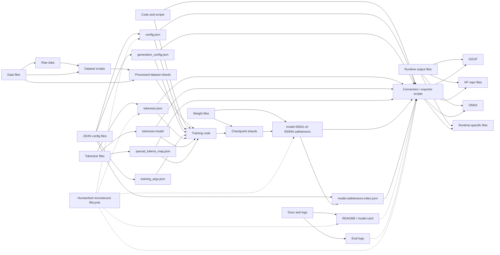

# Current Weight Lifecycle

Current training artifacts usually become maintainable through convention rather
than through one canonical file contract.

Mermaid source:
[current-weight-lifecycle.mmd](current-weight-lifecycle.mmd)

SVG render:
[current-weight-lifecycle.svg](current-weight-lifecycle.svg)





```text
raw data
  -> dataset scripts
  -> processed dataset shards
  -> tokenizer files
  -> training code
  -> model config JSON
  -> checkpoint shards
  -> safetensors or framework weights
  -> exporter metadata
  -> GGUF / HF / ONNX / runtime-specific files
```

The useful pieces exist, but the relationships are spread across several files:

```text
config.json
tokenizer.json
tokenizer.model
special_tokens_map.json
generation_config.json
model.safetensors.index.json
model-00001-of-000NN.safetensors
training_args.json
README.md / model card
eval logs
conversion scripts
```

The weight lifecycle is therefore reconstructed by tools and humans:

```text
which data produced the weights?
which tokenizer was used?
which architecture matches the tensor names?
which checkpoint is canonical?
which evals justify the export?
which conversion path produced the GGUF?
```

That is workable, but it is not a flat artifact. The model is a directory of
related state, and the meaning of the final weights depends on conventions around
JSON, safetensors, scripts, and README/model-card text.
