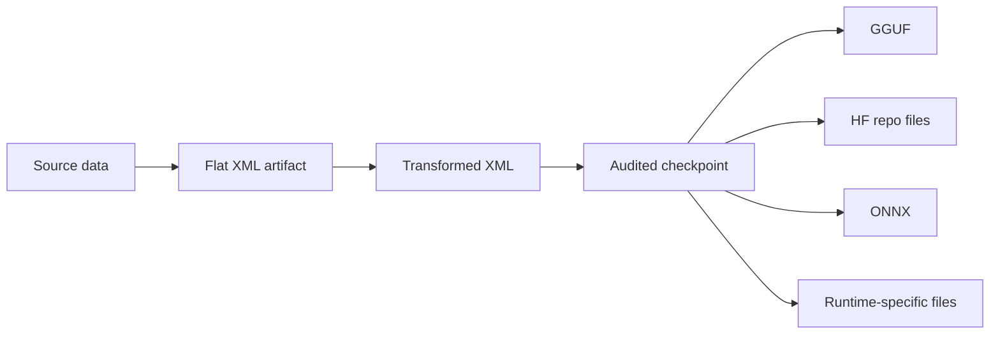
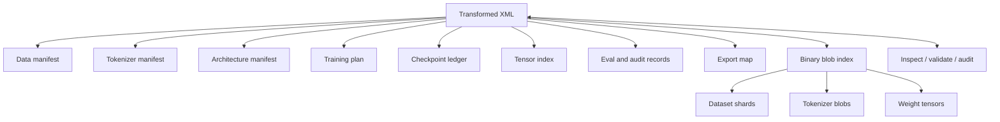

# DayCare Flat XML Weight Lifecycle

The DayCare proposal is a flat XML-controlled artifact where one manifest
describes the full lifecycle from data to weights.

Mermaid source:
[daycare-flat-xml-weight-lifecycle.mmd](daycare-flat-xml-weight-lifecycle.mmd)

SVG render:
[daycare-flat-xml-weight-lifecycle.svg](daycare-flat-xml-weight-lifecycle.svg)





```text
flat XML artifact
  -> transformed XML
  -> audited checkpoint
  -> GGUF / HF / ONNX / runtime-specific files
```

Transformed XML covers:

Mermaid source:
[daycare-transformed-xml-coverage.mmd](daycare-transformed-xml-coverage.mmd)

SVG render:
[daycare-transformed-xml-coverage.svg](daycare-transformed-xml-coverage.svg)





- data manifest;
- tokenizer manifest;
- architecture manifest;
- training plan;
- checkpoint ledger;
- tensor index;
- eval and audit records;
- export map;
- binary blob index.

The XML does not need to store tensor bytes as text. It can index compact binary
payloads while keeping the relationships inspectable:

```text
daycare-model.xmlpack
  [XML manifest]
    data records
    tokenizer records
    architecture record
    training run ledger
    checkpoint records
    tensor names, shapes, dtypes, offsets, hashes
    eval records
    export targets
  [binary blob region]
    tokenizer blobs
    dataset shards
    weight tensors
```

The intended path is:

```text
source data
  -> flat XML training artifact
  -> transformed XML
  -> audited checkpoint
  -> GGUF or another runtime format
```

The maintainability claim is that a tool can inspect the model and the data from
one file contract:

```text
open XML
  -> inspect data lineage
  -> inspect tokenizer
  -> inspect architecture
  -> inspect weight tensor map
  -> inspect checkpoint provenance
  -> export to GGUF
```

That makes GGUF an output target, not the source of truth. The source of truth is
the flat XML artifact that explains how the data became weights and how those
weights map into runtime formats.
